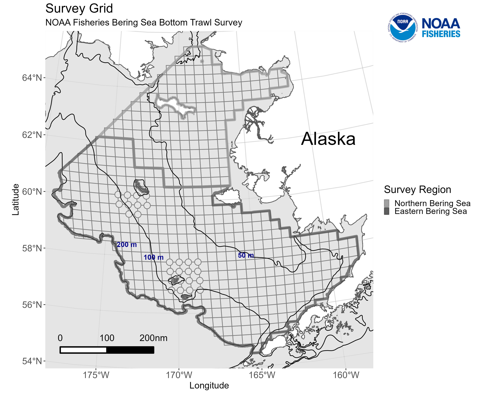
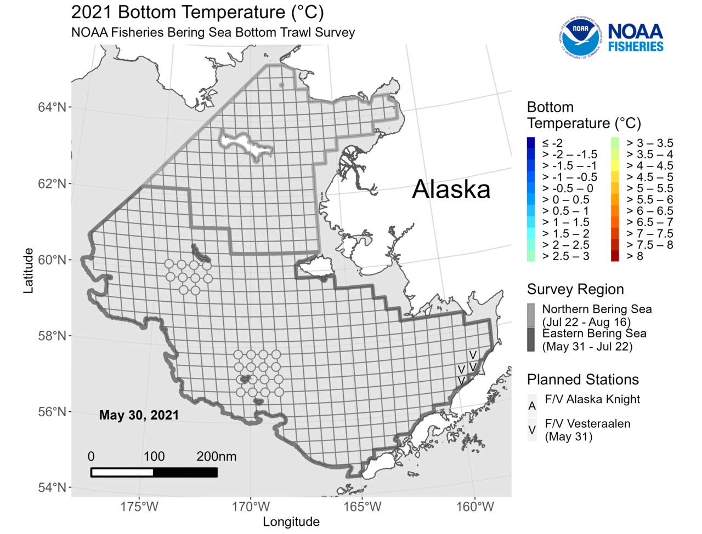

# GAP Survey Temperature Maps

<!-- badges: start -->
<!-- badges: end -->

> Code is still in development. 

## Developers

**Emily Markowitz** (Emily.Markowitz AT noaa.gov)

Research Fisheries Biologist

**Liz Dawson** (Liz.Dawson AT noaa.gov)

Fisheries Biologist

Alaska Fisheries Science Center, 

National Marine Fisheries Service, 

National Oceanic and Atmospheric Administration,

Seattle, WA 98195

## Use

These scripts create the daily tempertaure and anomaly plots as NOAA Fisheries' Alaska Fisheries Science Center conducts fisheries independant surveys in Alaska. 

These plots will be used to create pages like this on the AFSC website: https://www.fisheries.noaa.gov/alaska/science-data/near-real-time-temperatures-bering-sea-bottom-trawl-survey

With this script, we pull temperature content from google drive and then push the maps to google drive for the comms team. 

## Example files

> Note: Values are made up. 

### Blank, Grid-only Plot

### Daily Plot

### Anomaly Plot

### GIF of maps as they progressed over time

