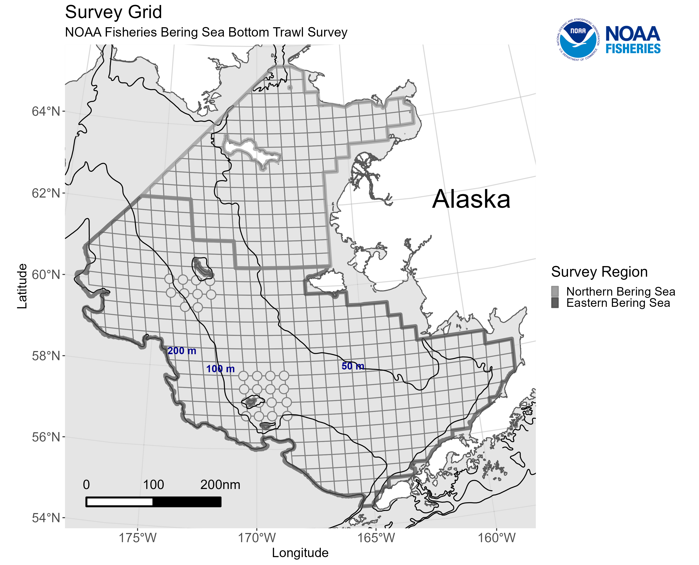
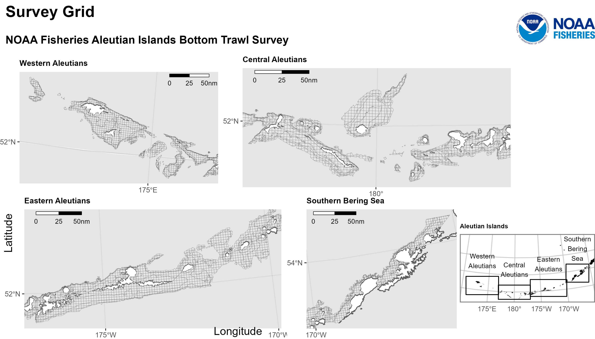
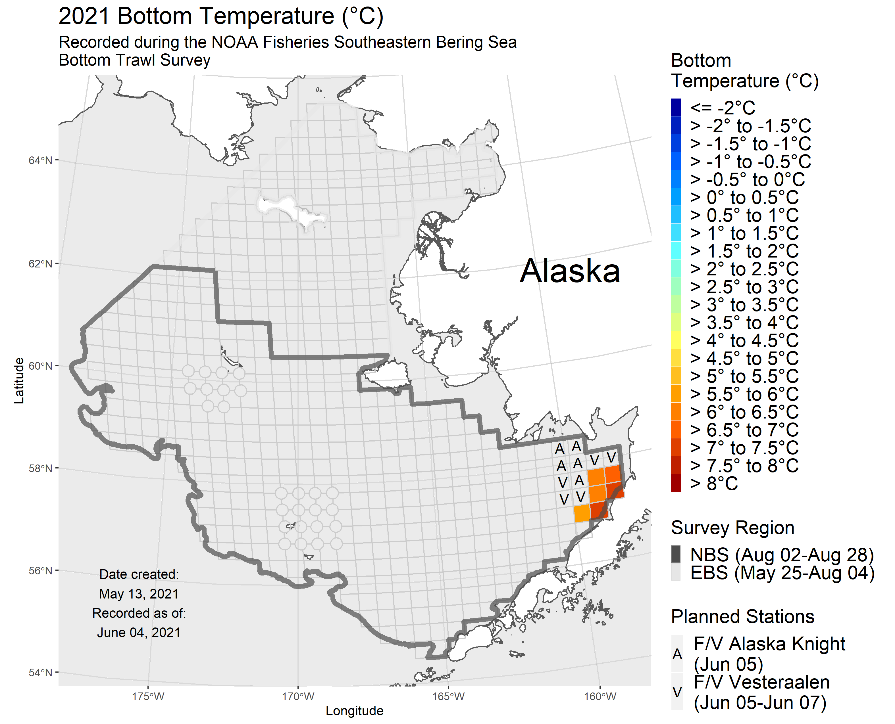
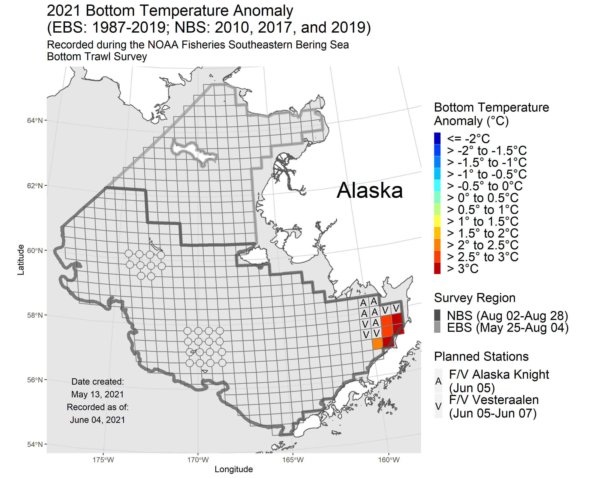

# RACE Groundfish and Crab Live Survey Temperature Maps

> Code is always in development. 

## Developers

**Emily Markowitz** (Emily.Markowitz AT noaa.gov)

Research Fisheries Biologist

**Liz Dawson** (Liz.Dawson AT noaa.gov)

Fisheries Biologist

**Caitlin Allen Akselrud** (caitlin.allen_akselrud AT noaa.gov)

Research Fisheries Biologist

Alaska Fisheries Science Center, 

National Marine Fisheries Service, 

National Oceanic and Atmospheric Administration,

Seattle, WA 98195

## Purpose

These scripts create daily survey station daily temperature and anomaly plots as the ships work their way through the Bering Sea. These ships are conducting NOAA Fisheries' Alaska Fisheries Science Center's fisheries independent surveys in the Eastern Bering Sea. Scripts pull temperatures from google drive, entered by FPCs at sea, create daily maps and composite gifs, and then push the maps to google drive for the communications team. These plots are displayed on the AFSC website

 - [2022 Eastern and Northern Bering Sea Bottom Trawl Survey](https://www.fisheries.noaa.gov/alaska/climate/near-real-time-temperatures-bering-sea-bottom-trawl-surveys-2022)
 - [2022 Aleutian Islands Bottom Trawl Survey](https://www.fisheries.noaa.gov/alaska/climate/near-real-time-temperatures-aleutian-islands-bottom-trawl-surveys-2022) 
 - [2021 Eastern and Northern Bering Sea Bottom Trawl Survey](https://www.fisheries.noaa.gov/alaska/science-data/near-real-time-temperatures-bering-sea-bottom-trawl-survey)
 - [2019 Eastern and Northern Bering Sea Bottom Trawl Survey](https://www.fisheries.noaa.gov/feature-story/2019-southeastern-bering-sea-shelf-bottom-trawl-survey-gets-underway)
 - [2018 Eastern Bering Sea Bottom Trawl Survey](https://www.fisheries.noaa.gov/resource/document/2018-eastern-bering-sea-continental-shelf-and-northern-bering-sea-trawl-surveys)
 - [2017 Eastern and Northern Bering Sea Bottom Trawl Survey](https://www.fisheries.noaa.gov/resource/document/2017-eastern-bering-sea-continental-shelf-and-northern-bering-sea-bottom-trawl)

## Notes

How to set up the task scheduler: https://docs.google.com/document/d/1pwBmR6AqgnvUx_AiWYQxtYxIRjWMfdd5EPWwFvpI3Ug/edit

Where the files will be saved to: https://drive.google.com/drive/u/2/folders/1BSMOHWQO_oWxF6AmOFI6sudiSbFLvToq

## Plot Examples

### Final combined gifs

### Blank, Grid-only Plot

### Daily Plot

### Anomaly Plot

## NOAA README

This repository is a scientific product and is not official communication of the National Oceanic and Atmospheric Administration, or the United States Department of Commerce. All NOAA GitHub project code is provided on an ‘as is’ basis and the user assumes responsibility for its use. Any claims against the Department of Commerce or Department of Commerce bureaus stemming from the use of this GitHub project will be governed by all applicable Federal law. Any reference to specific commercial products, processes, or services by service mark, trademark, manufacturer, or otherwise, does not constitute or imply their endorsement, recommendation or favoring by the Department of Commerce. The Department of Commerce seal and logo, or the seal and logo of a DOC bureau, shall not be used in any manner to imply endorsement of any commercial product or activity by DOC or the United States Government.

## NOAA License

Software code created by U.S. Government employees is not subject to copyright in the United States (17 U.S.C. §105). The United States/Department of Commerce reserve all rights to seek and obtain copyright protection in countries other than the United States for Software authored in its entirety by the Department of Commerce. To this end, the Department of Commerce hereby grants to Recipient a royalty-free, nonexclusive license to use, copy, and create derivative works of the Software outside of the United States.

[U.S. Department of Commerce](https://www.commerce.gov/) | [National
Oceanographic and Atmospheric Administration](https://www.noaa.gov) |
[NOAA Fisheries](https://www.fisheries.noaa.gov/)
