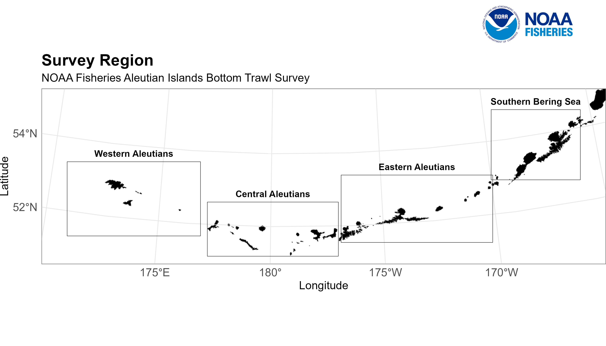
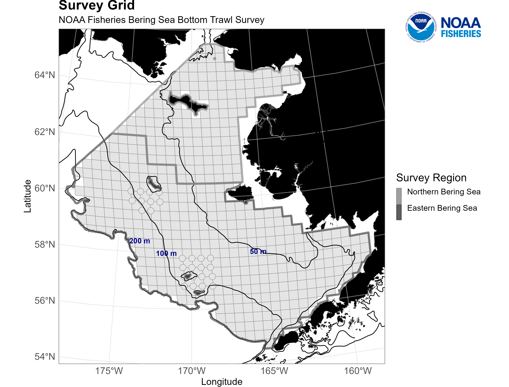

<!-- README.md is generated from README.Rmd. Please edit that file -->

# [RACE Groundfish and Crab Live Survey Temperature Maps](https://github.com/afsc-gap-products/survey-live-temperature-map) 

> This code is always in development. Find code used for final products
> of this code in
> [releases](paste0(https://github.com/afsc-gap-products/survey-live-temperature-map,%20%22/releases%22)).

## This code is primarally maintained by:

**Emily Markowitz** (Emily.Markowitz AT noaa.gov;
[@EmilyMarkowitz-NOAA](https://github.com/EmilyMarkowitz-NOAA))

**Liz Dawson** (Liz.Dawson AT noaa.gov;
[@liz-dawson-NOAA](https://github.com/liz-dawson-NOAA))

**Chris Anderson** (Christopher.Anderson AT noaa.gov;
[@ChrisAnderson-NOAA](https://github.com/ChrisAnderson-NOAA))

**Caitlin Allen Akselrud** (past; caitlin.allen_akselrud AT noaa.gov;
[@CaitlinAkselrud-NOAA](https://github.com/CaitlinAkselrud-NOAA))

Alaska Fisheries Science Center,

National Marine Fisheries Service,

National Oceanic and Atmospheric Administration,

Seattle, WA 98115

# Table of contents

> - [*Purpose*](#purpose)
> - [*Learn more about these surveys and ocean temperatures around
>   Alaska*](#learn-more-about-these-surveys-and-ocean-temperatures-around-alaska)
> - [*Notes*](#notes)
> - [*Plot Examples *](#plot-examples-)
>   - [*Final stacked gifs*](#final-stacked-gifs)
>   - [*Blank, Grid-only Plot*](#blank,-grid-only-plot)
>   - [*Mean Plot*](#mean-plot)
>   - [*Anomaly Plot*](#anomaly-plot)
> - [*Suggestions and Comments*](#suggestions-and-comments)
>   - [*R Version Metadata*](#r-version-metadata)
>   - [*NOAA README*](#noaa-readme)
>   - [*NOAA License*](#noaa-license)

## Purpose

These scripts create daily survey station daily temperature and anomaly
plots as the ships work their way through the Bering Sea. These ships
are conducting NOAA Fisheries’ Alaska Fisheries Science Center’s
fisheries independent surveys in the Eastern Bering Sea. Scripts pull
temperatures from google drive, entered by FPCs at sea, create daily
maps and composite gifs, and then push the maps to google drive for the
communications team. These plots are displayed on the AFSC website

- [2022 Eastern and Northern Bering Sea Bottom Trawl
  Survey](https://www.fisheries.noaa.gov/alaska/climate/near-real-time-temperatures-bering-sea-bottom-trawl-surveys-2022)
- [2022 Aleutian Islands Bottom Trawl
  Survey](https://www.fisheries.noaa.gov/alaska/climate/near-real-time-temperatures-aleutian-islands-bottom-trawl-surveys-2022)
- [2021 Eastern and Northern Bering Sea Bottom Trawl
  Survey](https://www.fisheries.noaa.gov/alaska/science-data/near-real-time-temperatures-bering-sea-bottom-trawl-survey)
- [2019 Eastern and Northern Bering Sea Bottom Trawl
  Survey](https://www.fisheries.noaa.gov/feature-story/2019-southeastern-bering-sea-shelf-bottom-trawl-survey-gets-underway)
- [2018 Eastern Bering Sea Bottom Trawl
  Survey](https://www.fisheries.noaa.gov/resource/document/2018-eastern-bering-sea-continental-shelf-and-northern-bering-sea-trawl-surveys)
- [2017 Eastern and Northern Bering Sea Bottom Trawl
  Survey](https://www.fisheries.noaa.gov/resource/document/2017-eastern-bering-sea-continental-shelf-and-northern-bering-sea-bottom-trawl)

## Learn more about these surveys and ocean temperatures around Alaska

**Eastern Bering Sea Shelf (EBS) and Northern Bering Sea (NBS)**
(Markowitz, Dawson, Charriere, Prohaska, Rohan, Stevenson, et al.,
2022b, 2022a, In review; Markowitz, Dawson, Charriere, Prohaska, Rohan,
Haehn, et al., 2022)

**Aleutian Islands (AI)** (Von Szalay and Raring, 2020)

**Gulf of Alaska (GOA)** (Von Szalay and Raring, 2018)

**Cold pool research** (Rohan et al., 2022)

<div id="refs" class="references csl-bib-body hanging-indent"
line-spacing="2">

<div id="ref-2018EBS2022" class="csl-entry">

Markowitz, E. H., Dawson, E. J., Charriere, N. E., Prohaska, B. K.,
Rohan, S. K., Haehn, R. A., Stevenson, D. E., and Britt, L. L. (2022).
*Results of the 2018 eastern Bering Sea continental shelf bottom trawl
survey of groundfish and invertebrate fauna* (NOAA Tech. Memo.
NMFS-F/SPO-450; p. 183). U.S. Dep. Commer.
<https://doi.org/10.25923/m4pw-t510>

</div>

<div id="ref-2019NEBS2022" class="csl-entry">

Markowitz, E. H., Dawson, E. J., Charriere, N. E., Prohaska, B. K.,
Rohan, S. K., Stevenson, D. E., and Britt, L. L. (2022a). *Results of
the 2019 eastern and northern Bering Sea continental shelf bottom trawl
survey of groundfish and invertebrate fauna* (NOAA Tech. Memo.
NMFS-F/SPO-451; p. 225). U.S. Dep. Commer.
<https://doi.org/10.25923/d641-xb21>

</div>

<div id="ref-2021NEBS2022" class="csl-entry">

Markowitz, E. H., Dawson, E. J., Charriere, N. E., Prohaska, B. K.,
Rohan, S. K., Stevenson, D. E., and Britt, L. L. (2022b). *Results of
the 2021 eastern and northern Bering Sea continental shelf bottom trawl
survey of groundfish and invertebrate fauna* (NOAA Tech. Memo.
NMFS-F/SPO-452; p. 227). U.S. Dep. Commer.
<https://doi.org/10.25923/g1ny-y360>

</div>

<div id="ref-2022NEBS2022" class="csl-entry">

Markowitz, E. H., Dawson, E. J., Charriere, N. E., Prohaska, B. K.,
Rohan, S. K., Stevenson, D. E., and Britt, L. L. (In review). *Results
of the 2022 eastern and northern Bering Sea continental shelf bottom
trawl survey of groundfish and invertebrate fauna* \[NOAA Tech. Memo.\].
U.S. Dep. Commer.

</div>

<div id="ref-RohanColdPool" class="csl-entry">

Rohan, S., Barnett, L., and Charriere, N. (2022). *Evaluating approaches
to estimating mean temperatures and cold pool area from AFSC bottom
trawl surveys of the eastern Bering Sea* (NOAA Tech. Memo.
NMFS-AFSC-456; p. 42). U.S. Dep. Commer.
<https://doi.org/10.25923/1wwh-q418>

</div>

<div id="ref-GOA2018" class="csl-entry">

Von Szalay, P. G., and Raring, N. W. (2018). *Data report: 2017 gulf of
alaska bottom trawl survey* (NOAA Tech. Memo. NMFS-AFSC-374). U.S. Dep.
Commer.
<https://apps-afsc.fisheries.noaa.gov/Publications/AFSC-TM/NOAA-TM-AFSC-374.pdf>

</div>

<div id="ref-AI2018" class="csl-entry">

Von Szalay, P. G., and Raring, N. W. (2020). *Data report: 2018 aleutian
islands bottom trawl survey* (NOAA Tech. Memo. NMFS-AFSC-409). U.S. Dep.
Commer. <https://repository.library.noaa.gov/view/noaa/26367>

</div>

</div>

## Notes

How to set up the task scheduler:
<https://docs.google.com/document/d/1pwBmR6AqgnvUx_AiWYQxtYxIRjWMfdd5EPWwFvpI3Ug/edit>

Where the files will be saved to:
<https://drive.google.com/drive/u/2/folders/1BSMOHWQO_oWxF6AmOFI6sudiSbFLvToq>

Troubleshooting: if the task scheduler fails to run the code, but you
can run the script in R or Rstudio, you may need to update Pandoc. The
latest version is here:
<https://github.com/jgm/pandoc/releases/tag/2.18>. If you are on a NOAA
machine, ask IT to install the .msi file for you. Close and reopen
everything and try again.

## Plot Examples

Find more plot examples
[here](https://github.com/afsc-gap-products/survey-live-temperature-map/tree/main/test).

### Final stacked gifs

``` r
cat(print_figs(string_id = "current_daily_", file_type = "gif"))
```

    FALSE ![NOAA Fisheries conducted the Aleutian Islands bottom trawl survey in 2022 aboard the F/V Ocean Explorer and F/V Alaska Provider. This survey covers the Central Aleutians, Eastern Aleutians, Southern Bering Sea, and Western Aleutians regions, which are randomly sampled each year. The near real-time ocean bottom temperatures depicted were collected June 10-August 13 No stations were sampled on August 13 Allocated stations that have not yet been sampled are shown as grey dots. Credit: NOAA Fisheries](./test/current_daily_ai.gif)
    FALSE  
    FALSE  

### Blank, Grid-only Plot

``` r
a <- print_figs(string_id = "current_grid_")
print(a)
```

    FALSE 
    FALSE 
    FALSE 
    FALSE 
    FALSE 

### Mean Plot

``` r
print_figs(string_id = "current_mean_")
```

    FALSE 

### Anomaly Plot

``` r
a <- print_figs(string_id = "current_anom_")
```


# Suggestions and Comments

If you see that the data, product, or metadata can be improved, you are
invited to create a [pull
request](https://github.com/afsc-gap-products/survey-live-temperature-map/pulls),
[submit an issue to the GitHub
organization](https://github.com/afsc-gap-products/data-requests/issues),
or [submit an issue to the code’s
repository](https://github.com/afsc-gap-products/survey-live-temperature-map/issues).

## R Version Metadata

``` r
sessionInfo()
```

    FALSE R version 4.2.2 (2022-10-31 ucrt)
    FALSE Platform: x86_64-w64-mingw32/x64 (64-bit)
    FALSE Running under: Windows 10 x64 (build 19045)
    FALSE 
    FALSE Matrix products: default
    FALSE 
    FALSE locale:
    FALSE [1] LC_COLLATE=English_United States.utf8  LC_CTYPE=English_United States.utf8    LC_MONETARY=English_United States.utf8
    FALSE [4] LC_NUMERIC=C                           LC_TIME=English_United States.utf8    
    FALSE 
    FALSE attached base packages:
    FALSE [1] stats     graphics  grDevices utils     datasets  methods   base     
    FALSE 
    FALSE other attached packages:
    FALSE [1] glue_1.6.2
    FALSE 
    FALSE loaded via a namespace (and not attached):
    FALSE  [1] qpdf_1.3.0         tidyselect_1.2.0   xfun_0.37          janitor_2.2.0      purrr_1.0.1        sf_1.0-9           gargle_1.3.0      
    FALSE  [8] snakecase_0.11.0   colorspace_2.1-0   vctrs_0.5.2        generics_0.1.3     htmltools_0.5.4    viridisLite_0.4.1  yaml_2.3.7        
    FALSE [15] readtext_0.81      utf8_1.2.3         rlang_1.0.6        e1071_1.7-13       pillar_1.8.1       DBI_1.1.3          readxl_1.4.2      
    FALSE [22] lifecycle_1.0.3    stringr_1.5.0      munsell_0.5.0      gtable_0.3.1       cellranger_1.1.0   evaluate_0.20      knitr_1.42        
    FALSE [29] fastmap_1.1.0      class_7.3-20       fansi_1.0.4        Rcpp_1.0.10        KernSmooth_2.23-20 akgfmaps_2.3.1     scales_1.2.1      
    FALSE [36] classInt_0.4-9     magick_2.7.4       fs_1.6.1           gridExtra_2.3      ggplot2_3.4.1      askpass_1.1        digest_0.6.31     
    FALSE [43] ggspatial_1.1.7    stringi_1.7.12     dplyr_1.1.0        grid_4.2.2         cli_3.6.0          tools_4.2.2        bitops_1.0-7      
    FALSE [50] magrittr_2.0.3     RCurl_1.98-1.10    proxy_0.4-27       tibble_3.1.8       crayon_1.5.2       pkgconfig_2.0.3    data.table_1.14.6 
    FALSE [57] googledrive_2.0.0  lubridate_1.9.2    timechange_0.2.0   httr_1.4.5         rmarkdown_2.20     rstudioapi_0.14    viridis_0.6.2     
    FALSE [64] R6_2.5.1           units_0.8-1        compiler_4.2.2

## NOAA README

This repository is a scientific product and is not official
communication of the National Oceanic and Atmospheric Administration, or
the United States Department of Commerce. All NOAA GitHub project code
is provided on an ‘as is’ basis and the user assumes responsibility for
its use. Any claims against the Department of Commerce or Department of
Commerce bureaus stemming from the use of this GitHub project will be
governed by all applicable Federal law. Any reference to specific
commercial products, processes, or services by service mark, trademark,
manufacturer, or otherwise, does not constitute or imply their
endorsement, recommendation or favoring by the Department of Commerce.
The Department of Commerce seal and logo, or the seal and logo of a DOC
bureau, shall not be used in any manner to imply endorsement of any
commercial product or activity by DOC or the United States Government.

## NOAA License

Software code created by U.S. Government employees is not subject to
copyright in the United States (17 U.S.C. §105). The United
States/Department of Commerce reserve all rights to seek and obtain
copyright protection in countries other than the United States for
Software authored in its entirety by the Department of Commerce. To this
end, the Department of Commerce hereby grants to Recipient a
royalty-free, nonexclusive license to use, copy, and create derivative
works of the Software outside of the United States.


[U.S. Department of Commerce](https://www.commerce.gov/) \| [National
Oceanographic and Atmospheric Administration](https://www.noaa.gov) \|
[NOAA Fisheries](https://www.fisheries.noaa.gov/)
